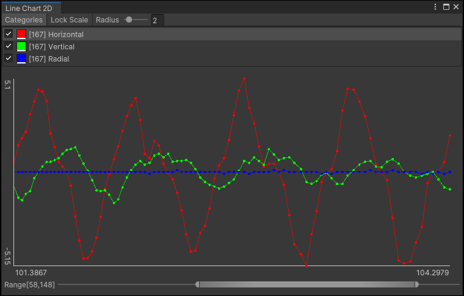

# Unity Editor Data Chart Tool

Draw data chart in Unity Editor.

[中文](./README_CN.md)

## Supported Unity Version

Unity 2021.3 and later.

## Installation

Install this package via [OpenUPM](https://openupm.com/packages/com.greenbamboogames.editordatachart) .

## API

- class LineChart2DWindow
    - static void Open(string title): Open data chart window.
    - void SetColor(string category, Color color): Set the color of the category.
    - void AddData(string category, Vector2 data): Add data to category.
    - bool RemoveData(string category, int index): Remove data from category.
    - bool ClearData(string category): Clear data of category(will remove category).
    - void ClearAllData(): Clear all categories(will remove all categories).
    - int FindDataIndex(string category, Predicate<Vector2> match): Find the index of the data in category.
    - int FindDataLastIndex(string category, Predicate<Vector2> match): Find the last index of the data in category.
    - void SetChartScale(float xValueLength, float yMinValue, float yMaxValue): Set visible value range of the chart.
    - void RemoveChartScale(): Remove visible value range of the chart.

