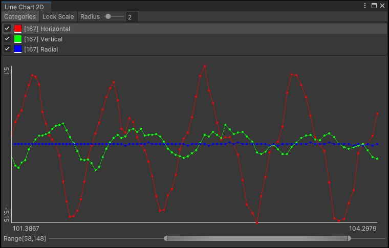

# Unity Editor数据图表工具

在Unity Editor绘制数据图表。

[English](./README.md)

## 支持的Unity版本

Unity 2021.3 或更新版本。

## 安装

从 [OpenUPM](https://openupm.cn/packages/com.greenbamboogames.editordatachart) 安装。

## API

- class LineChart2DWindow
    - static void Open(string title): 打开数据图表窗口。
    - void SetColor(string category, Color color): 设置类别颜色。
    - void AddData(string category, Vector2 data): 向类别中添加数据。
    - bool RemoveData(string category, int index): 从类别中移除数据。
    - bool ClearData(string category): 清空类别中的数据（将会删除此类别）。
    - void ClearAllData(): 清空所有类别中的数据（将会删除所有类别）。
    - int FindDataIndex(string category, Predicate<Vector2> match): 在类别中查找指定数据的索引。
    - int FindDataLastIndex(string category, Predicate<Vector2> match): 在类别中查找指定数据的最后一个索引。
    - void SetChartScale(float xValueLength, float yMinValue, float yMaxValue): 设置图表的显示数值范围。
    - void RemoveChartScale(): 移除图表的显示数值范围。

